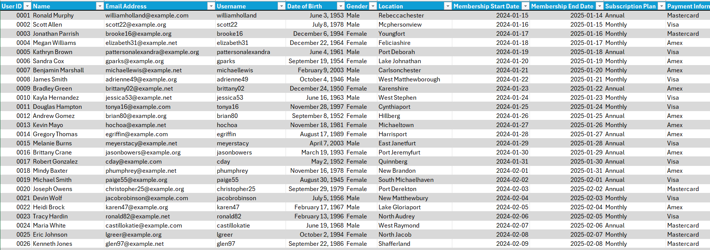

# Customer Lifetime Value (CLV) Analysis on Amazon Prime Users

## I. Project Overview
This Microsoft Excel-based project aims to perform a CLV analysis on a fictitious dataset containing personal information on 2,500 Amazon Prime users. The dataset represents a diverse range of Prime users, including different demographics, subscription plans, and usage patterns. More information about the dataset can be found at this [URL](https://www.kaggle.com/datasets/arnavsmayan/amazon-prime-userbase-dataset/data). CLV is a measure of the total revenue a business can expect to generate from a typical customer over the entire period of their relationship. Understanding CLV is essential for developing strategies around pricing, sales, advertising, and customer retention.

There are two ways to consider customer lifetime value: historical CLV (how much each existing customer has already spent with your brand) and predictive CLV (how much customers could spend with your brand). For this project, the goal is predictive—to perform a CLV analysis across different quarters from 2024 to 2030, based on subscription revenue and churn rate. This analysis includes customers from previous quarters in the cumulative total to provide a more comprehensive view of customer value and performance over time, using a presumed Customer Acquisition Cost (CAC) of $4.14 and the current Amazon Prime pricing model in the US. The objective is to identify high-value user segments and develop strategies to increase CLV while ensuring cost optimization.

## II. Description of Approach
1. **Data Cleaning:**
   - The data was cleaned to ensure accuracy.
   - No duplicates were found.
   - User IDs were standardized to four digits, and dates were reformatted to "yyyy-mm-dd" format.
     
2. **Data Preparation:**
   - The formula used for each CLV value was: CLV = (CV (Customer Value) / Retention Rate) − CAC. Additional columns were created to apply this formula   appropriately.
   - The retention rate was calculated by finding the total number of customers retained each quarter using the COUNTIFS formula, dividing that value by the total number of customers, and multiplying the result by 100.
   - The CV value was calculated using the formula: CV = ARPU (Average Revenue Per User) × Average Customer Lifetime.
   - The number of monthly and annual subscribers was found using COUNTIFS, then multiplied by the respective subscription rates and added to find the total revenue for the quarter. This was divided by the total number of users to find the ARPU.
   - The average customer lifetime was assumed to be 365 days for all customers in the dataset.
   - After calculating the CLV value, the results were extracted into the original table using INDEX and MATCH formulas

## III. Discusiion & Findings

The results were visualized using a PivotTable and subsequently, a PivotChart. Using slicers, users can dynamically filter and explore the data by different categories such as gender, favorite genres, subscription plans, and engagement metrics, allowing for a more interactive and focused analysis. From this dashboard, high-value user segments were identified, including female users and monthly subscribers. Based on these insights, recommendations can be provided to policymakers, which have been included in the following [presentation](https://github.com/daniellaakpoguma/Data-Analsyt-Portfolio/blob/main/CLV%20Analysis%20On%20Amazon%20Prime%20Users/Amazon%20Prime%20Users%20-%20CLV%20Analysis%20Presentation.pptx). These recommendations aim to guide marketing strategies, improve customer retention, optimize costs, increase revenue, and enhance overall business operations.

## IV. References
1. https://www.qualtrics.com/en-gb/experience-management/customer/customer-lifetime-value/
2. https://www.netsuite.com/portal/resource/articles/ecommerce/customer-lifetime-value-clv.shtml

