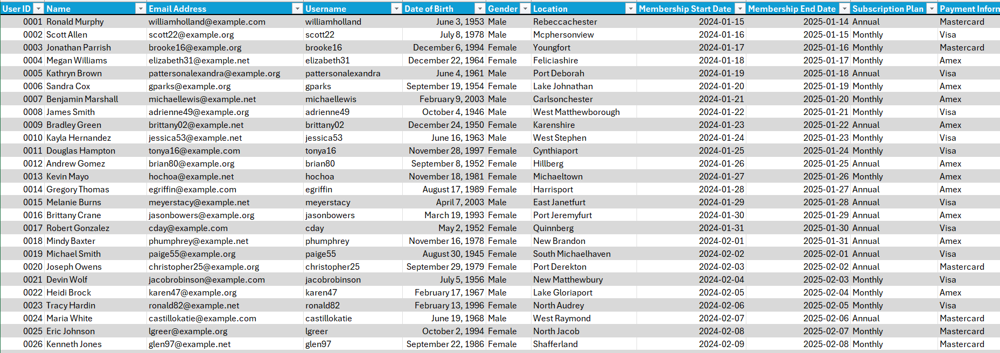
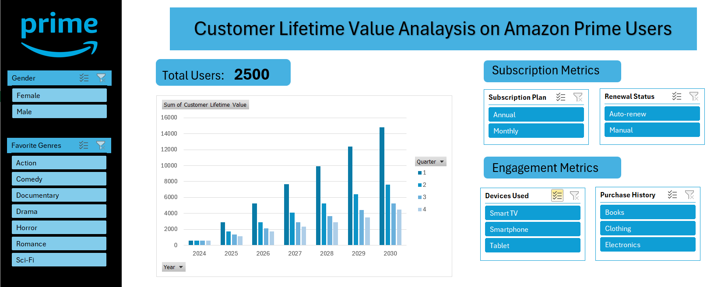

Dataset Source: https://www.kaggle.com/datasets/arnavsmayan/amazon-prime-userbase-dataset/data 
## About Dataset
The dataset comprises details of 2500 fictitious Amazon Prime users, offering a broad spectrum of subscription plans and usage behaviors. 
Its purpose is to enable thorough examination and understanding of user actions, preferences, and engagements within the Amazon Prime ecosystem.

## I. Project Goals and Tasks 
To perform a Customer Lifetime Value (CLV) Analysis across different quarters from years 2024 till 2030 based on subscription revenue, and churn rate,
including customers from previous quarters in the cumulative total to provide a more comprehensive view of customer value and performance over time and
using a presumed CAC ( Customer Acquisition Cost) value of $4.14 and the current Amazon Prime pricing model in the US.
The goal was to identify high-value user segments and develop strategies to increase CLV and ensuring cost optimization 

## II. Description of Approach
Data Cleaning: First of all, the data was cleaned. No duplicates were found, the user IDs were all formatted to use four digits, and dates reformatted to be in a 
"yyyy-mm-dd" format. The formula used for each CLV value was: CLV= (CV (Customer Value) /Retention Rate) − CAC. The retention rate was calculated by finding the total
number of customers retained each quarter using the COUNTIFS formula, and dividing that value by the the total number of customers also found using COUNTIFS and 
multiplying the resulting value by a hundred.The CV value was found using theis formula : CV = ARPU (Average Revenue Per User) × Average Customer Lifetime. The number 
of monthly and annual subscribers were also found using COUNTIFS, and then mutliplied by the monthly and annual subcription rates respectively, and added to find the 
total revenue for the quarter, and divided by the toatl number of users to find the ARPU. The average customer lifetime was given as 365 for all customers in the dataset.
After the CLV value was found, the value were then extracted into the original table undex INDEX and MATCH formulas. 

## III. Results
The high-value user segments were found after creating a PivotChart and a PivotTable, and using slicers that allowed us to analyze this data. Using this sgements,
marketing strategies and policies have been found to imporve customer retention and cost optimization. 

